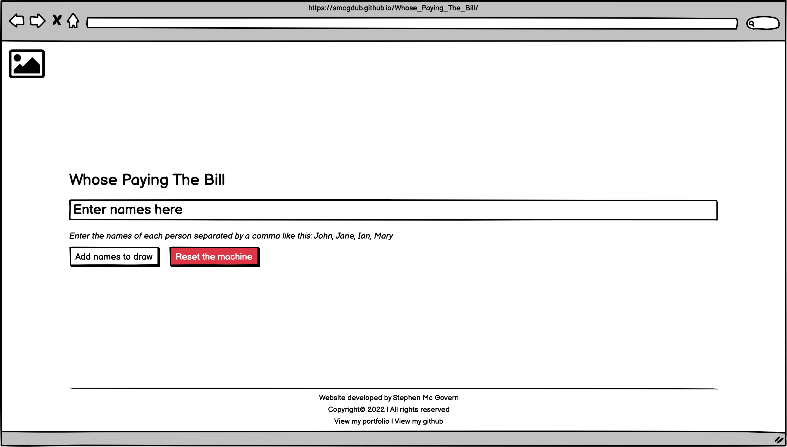

# **Whose Paying The Bill?**

## **Introduction**

Whose paying the bill is a just for fun mini JavaScript project where users who have been for dinner, drinks, or both, can play a game of chance and see whose going to pay the bill for everyone.

## **Table of contents** 

### **1. User Experience (UX)**
  * 1.1 Target audience
  * 1.2 Visitor goals
  * 1.3 Business goals
  * 1.4 User stories
  * 1.5 Design choices
  * 1.6 Wire frames

### **2. Features**
  * 2.1 User Inputs
  * 2.2 Action Buttons
  * 2.3 Result
  * 2.4 Footer
  * 2.5 Features Left To Implement

### **3. Technologies/Languages Used**
  * 3.1 VSCode
  * 3.2 HTML5
  * 3.3 CSS
  * 3.4 JavaScript
  * 3.5 Bootstrap
  * 3.6 Google fonts 
  * 3.7 Balsamiq
  * 3.8 Animate.css
  * 3.9 favicon.io

### **4. Testing**
  * 4.1 See [testing.md](testing.md) document 

### **5. Deployment**

  * 5.1 Deployment 
  * 5.2 Cloning 
  * 5.3 Cloning Desktop

### **6. Credits**
  * 6.1 Media
  * 6.2 Code

### **7. Contact**
  * 7.1 LinkedIn
  * 7.2 Email
  * 7.3 Skype
  * 7.4 My portfolio page

### **8. Disclaimer**

  * 8.1 Disclaimer on project 

<strong>1. User Experience (UX)</strong>

 

#### **1.1 Target Audience**

* Anyone who has been for dinner, drinks, or both and wants to play a game of chance to see who will be paying the bill for everybody. 

#### **1.2 Visitor goals** 

* I want to be able to enter the names of all my friends/colleagues to see which one of us will be paying the bill for everyone. 

#### **1.3 Business goals**

* No business or monetary goals, just a little game of chance to see whose going to pay everyone's bill. 

#### **1.4 User Stories**

* As a visitor to the company website i expect/want/need
 

#### **1.5 Design choices** 

* I kept this project nice and simple, there is a background image with a user input and 2 action buttons for the user to interact with. I have also added a little bit of fade in animation to the project to give it a more pleasing aesthetic. 

#### **FONTS**

* I decided i would use the Google fonts [Open Sans](https://fonts.google.com/specimen/Open+Sans?preview.text=Whose%20paying%20the%20bill&preview.text_type=custom). Open Sans is a humanist sans serif typeface designed by Steve Matteson. Open Sans was designed with an upright stress, open forms and a neutral, yet friendly appearance. It was optimized for print, web, and mobile interfaces, and has excellent legibility characteristics in its letterforms.

#### **ICONS**

* There was no need for any icons to be used in this project as its a very simple one.  

#### **COLORS**

* The color pallet for the project is very simple and only made up of 3 colors. The color pallette can be found below. 

#### **1.6 Wire Frames** 

* The wireframes for the project can be seen below. There is a wireframe for desktop, tablet and mobile.

#### **DESKTOP**

#### **TABLET**

#### **MOBILE**

<strong>2. Features</strong>

 

#### **2.1 User Inputs** 

* The user only has 1x input field to interact with. The user will enter all the names of the people who have entered the game separated by a comma. 

`<input id="names" type="text" class="form-control" placeholder="Enter names here" aria-label="names" aria-describedby="names" required>`

* Once all the names have been entered the user presses the add names to draw button and the JavaScript will then randomly draw and display the name fo the person who is paying the bill. 

#### **2.2 Action Buttons**

* There are 2 buttons for the user to interact with. The "Add names to draw" button and the "Reset the machine" button. Once a user has entered the names of everyone in the draw they will press the "Add names to draw" button.

`<button id="btn" class="btn add_names_to_draw_btn" onclick="addTo()">Add names to draw</button>`

* This button has an `onclick="addTo()"` function linked to it that is the JavaScript logic that will carry out the draw

* The second button "Reset the machine" will reset the game and the user can begin again from scratch. 

`<button id="reset_button" class="btn btn-danger" onclick="reloadPage()">Reset the machine</button>`

* This button has an `onclick="reloadPage()"` function linked to it that will reload the page so the user can start again from scratch. 

#### **2.3 Result**

* The result of who is going to pay the bill is displayed to the user in a `
` element. That `
` element is left blank and its content is generated and displayed when the user adds the names and completes the draw. There is also a cheeky message saying better luck next time. 

#### **2.4 Footer**

* The footer contains the basic information on the site and the copyright.

#### **2.5 Features Left To Implement**

* I may add a feature where people can add dinner and drinks separate. Depending on the restaurant sometimes the drinks bill can be more then the meal. So i may add a feature for a 2nd draw where food and drinks can be split into 2 separate draws. 

<strong>3. Technologies/Languages Used</strong>

 

3.1 [VSCode](https://code.visualstudio.com/) - Is the IDE i used for this project 
3.2 [HTML5](https://html.com/html5/#What_is_HTML) - This is the markup language i used for this project. 
3.3 [CSS](https://en.wikipedia.org/wiki/CSS) - I used CSS to help alter and adjust the presentation of the website to create a pleasant user experience. 
3.4 [JavaScript](https://en.wikipedia.org/wiki/JavaScript) - JavaScript was used to do the mathematics to give the user the full breakdown 
3.5 [Bootstrap](https://getbootstrap.com/) - Bootstrap is the most popular CSS Framework for developing responsive and mobile-first websites. Bootstrap 5 is the version i used for the development of this project. 
3.6 [Google fonts](https://fonts.google.com/) - Launched in 2010 Google Fonts is a library of 1,023 free licensed font families. 
3.7 [Balsamiq](https://balsamiq.com/)- Balsamiq Wireframes is a rapid low-fidelity UI wireframing tool that reproduces the experience of sketching on a notepad or whiteboard. 
3.8 [Animate.css](https://animate.style/) - Animate.css is a library of ready-to-use, cross-browser animations for use in your web projects. Great for emphasis, home pages, sliders, and attention-guiding hints. 
3.9 [favicon.io](https://favicon.io/) - Favicon.io is the free favicon generator i used for the project

<strong>4. Testing</strong>

 

* Testing information can be found in the [testing.md](testing.md) file

<strong>5. Deployment</strong>

 

#### **5.1 Deployment**  

To deploy the site on Github i undertook the following steps:

1. Navigated to my profile page on Github
2. Selected this project from the repositories
3. Clicked on settings
4. Click on pages which is on the left which is in the code and automation section
5. Click where is says source and in the dropdown menu select master 
6. Click on the next dropdown menu to the right select /(root)
7. Click save

You will then receive a confirmation saying the page has been published and also be provided with the link where people can view your site.

The link to view the live site can be found by clicking [Here](https://smcgdub.github.io/Whose_Paying_The_Bill/)

#### **5.2 Cloning**

You can clone the projects repository to your local computer by following the steps below:

Cloning a repository using the command line

1. On github navigate to the project repository. The link can be found here: https://github.com/smcgdub/Whose_Paying_The_Bill
2. Click on the tab that says < >code 
3. Above the files, click the button that says &#8595;code

4. From the menu select HTTPS
5. Click on the clipboard icon on the right hand side (Image below)

6. Open the terminal in your IDE
7. Change the current working directory to the location where you want the cloned directory.
8. In terminal type `git clone` and then paste the URL you copied earlier 
9. Press Enter to create your local clone.

#### **5.3 Cloning Desktop**
You can also clone the project using Github Desktop. To do this you can do the following: 

1. On github navigate to the project repository. The link can be found here: https://github.com/smcgdub/Whose_Paying_The_Bill
2. Click on the tab that says code 
3. Above the files, click the button that says &#8595;code

6. Click on Download ZIP.
7. Unzip the repository after it downloads to your machine and then drag the unzipped files into your IDE.

<strong>6. Credits</strong>
 
 

#### **6.1 Media** 

* Background image on the homepage credit goes to [Steve Harvey](https://unsplash.com/@trommelkopf) Link to the image can be found [Here](https://unsplash.com/photos/U4wcrDteZ2Y)

#### **6.2 Code** 

* All of the code in the project i have written myself 

<strong>7. Contact</strong>

 

Feel free to contact me on any of the following channels: 

* 7.1 [LinkedIn](https://www.linkedin.com/in/stephenmcgovern01/) 
* 7.2 [Email](mailto:stephen_xyz1@hotmail.com) 
* 7.3 [Skype](https://join.skype.com/invite/ndruMu7qVuKZ)
* 7.4 [My portfolio page](https://stephens-portfolio.com/)

<strong>8. Disclaimer</strong>

 

* 8.1 There is no monetization generated from this site. It is only intended as a fun game for people to play if out for dinner or drinks. 

