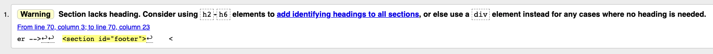
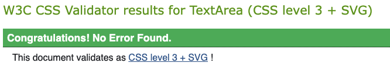

# **Whose Paying The Bill Testing Information?**

## **Table of contents** ##

### **1. Automated Testing** ###

* 1.1 HTML Code Validating 
* 1.2 CSS Code Validating
* 1.3 JavaScript Testing

### **2. Manual Testing** ###

* 2.1 Manual testing desktop
* 2.2 Manual testing tablet
* 2.3 Manual testing mobile

### **1. Automated Testing** ###

**1.1 HTML Code Validating**

* All of the HTML files were tested on the [W3C HTML Markup Validation website](https://validator.w3.org/)
* All of the files came back clear with the exception of one warning. The validator said the footer section is missing a `<h2>` - `<h6>` header. I am aware of this warning but have left this as there are no `<h2>` - `<h6>` tags required in the footer.

**1.2 CSS Code Validating**

* The main CSS files were tested on the [W3C CSS  Validation website](https://jigsaw.w3.org/css-validator/) 
* All of the files came back clear with the result of **"Congratulations! No Error Found."**

**1.3 JavaScript Code Validating**

* The main JavaScript file was tested on the [JShint website](https://jshint.com/)
* All of the JavaScript came back clear with no errors found

### **2. Manual Testing** ###

**2.1 Manual testing desktop**

All desktop testing was carried out on Chrome, FireFox, Safari, Brave, Opera & Edge browsers. To save repetition in the testing.md file when an feature is tested and listed as functioning correctly then readers of this file can know that testing was passed on all browsers. 

1. The page is loading as normal on all browsers. 
2. The input field is functioning as normal on all browsers 
3. The action buttons (Add names to draw & Reset the machine) are functioning as normal on all browsers 
4. The footer and the links within it are all working as normal on all browsers 

**2.3 Manual testing tablet**

All tablet testing was carried out on Chrome, FireFox, Brave, Opera & Edge browsers.

**2.3 Manual testing mobile**

All mobile testing was carried out on Chrome, FireFox, Brave, Opera & Edge browsers.

1. The one point i noted was when browsing on the brave Brave browser on a mobile device the input field and the add names to draw buttons should have a white background, but on this browser on a  mobile device they are showing with a background color of black. None of the functionality is effected and the site is working as intended, it is just an aesthetic bug that needs to be worked out

