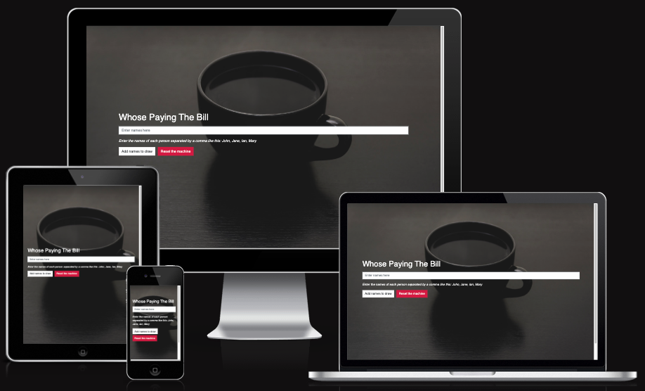

# **Whose Paying The Bill Testing Information?**

## **Table of contents** ##

### **1. Automated Testing** ###

* 1.1 HTML Code Validating 
* 1.2 CSS Code Validating
* 1.3 JavaScript Testing

### **2. Manual Testing** ###

* 2.1 Manual testing desktop
* 2.2 Manual testing mobile

### **1. Automated Testing** ###

**1.1 HTML Code Validating**

* All of the HTML files were tested on the [W3C HTML Markup Validation website](https://validator.w3.org/)
* All of the files came back clear with the exception of one warning. The validator said the footer section is missing a `<h2>` - `<h6>` header. I am aware of this warning but have left this as there are no `<h2>` - `<h6>` tags required in the footer.

**1.2 CSS Code Validating**

* The main CSS files were tested on the [W3C CSS  Validation website](https://jigsaw.w3.org/css-validator/) 
* All of the files came back clear with the result of **"Congratulations! No Error Found."**

**1.3 JavaScript Code Validating**

* The main JavaScript file was tested on the [JShint website](https://jshint.com/)
* All of the JavaScript came back clear with no errors found

### **2. Manual Testing** ###

**2.1 Manual testing desktop**

All desktop testing was carried out on Chrome, FireFox, Safari & Edge. To save repetition in the testing.md file when an feature is listed as no errors then readers of this file can know that testing was passed on every browser tested. 

**2.1 Manual testing mobile**

**10. The Footer**

* The footer works exactly the same on mobiles and tablets as it does on desktops.  

